# FyxToken Frontend

<div align="center">
  
</div>

<br>

<div align="center">
  
[](#)
[](https://reactjs.org/)
[](https://nodejs.org/)

</div>

Proyecto frontend desarrollado en React para gestión y visualización de tokens digitales. Ofrece una interfaz intuitiva y potente para el seguimiento, análisis y gestión de activos digitales en tiempo real.

## 📋 Tabla de Contenidos
- [✨ Caracteristicas](#-caracteristicas)
- [🛠️ Tecnologias](#-tecnologias)
- [💻 Instalacion](#-instalacion)
- [📁 Estructura del Proyecto](#-estructura-del-proyecto)
- [📱 Vistas](#-vistas)
- [🔧 Desarrollo](#-desarrollo)
- [📄 Licencia](#-licencia)

## ✨ Caracteristicas

### Core
- 📊 Sistema de trading en tiempo real
- 🎨 Tema claro/oscuro personalizable
- 📱 Diseño 100% responsivo
- 🔒 Autenticación segura (Pendiente)
- 📈 Gráficos interactivos

### Técnicas
- ⚡ Optimización de rendimiento con React
- 🛠️ Configuración personalizada con react-app-rewired
- 💅 Estilos con Material-UI y SASS
- 🔄 Estado global eficiente
- 📦 Componentes reutilizables

## 🛠️ Tecnologias

### Frontend Core
- React 18
- Material-UI
- SASS para estilos avanzados

### Desarrollo
- react-app-rewired para configuración
- Webpack personalizado
- ESLint para calidad de código

### Herramientas
- Node.js ≥ 14
- npm para gestión de paquetes
- Git para control de versiones

## 💻 Instalacion

1. **Clonar el repositorio**

2. **Instalar dependencias**
```bash
npm install
```

3. **Iniciar en modo desarrollo**
```bash
npm start
# La aplicación estará disponible en http://localhost:3000
```

4. **Construir para producción**
```bash
npm run build
```

## 📁 Estructura del Proyecto

```
frontend-fyxtoken/
├── public/
│   ├── img/               # Imágenes estáticas
│   └── index.html         # HTML principal
├── src/
│   ├── app/              # Lógica principal
│   ├── views/            # Componentes de vista
│   │   ├── wallet/      # Vistas del wallet
│   │   └── index.jsx    # Vista principal
│   ├── components/      # Componentes reutilizables
│   └── styles/         # Estilos SASS
└── config-overrides.js  # Configuración de webpack
```

## 📱 Vistas

### Inicio de Sesión
<div align="center">
  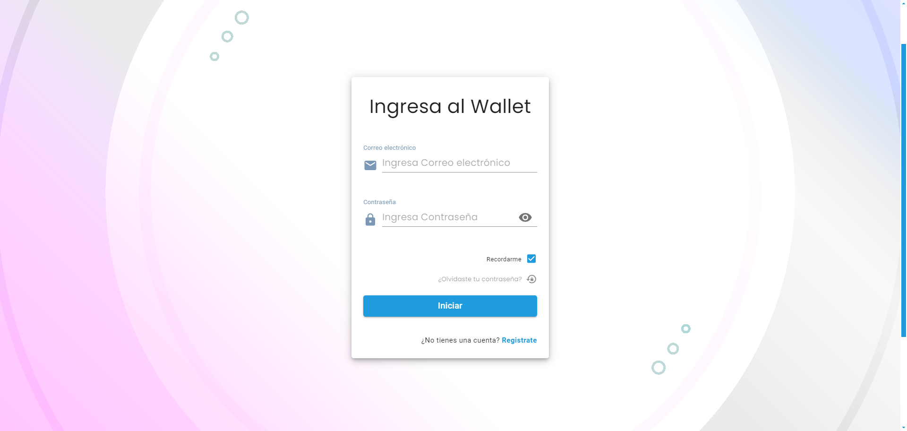
  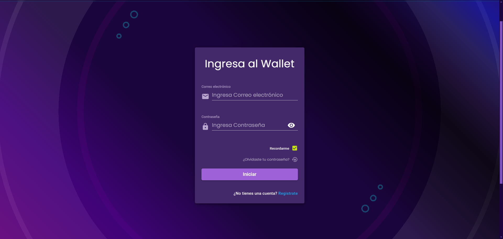
</div>

Sistema de autenticación con:
- Interfaz minimalista y moderna
- Alternancia entre tema claro/oscuro
- Validación de campos en tiempo real
- Recuperación de contraseña (Pendiente)
- Registro de usuarios (Pendiente)

### Wallet
<div align="center">
  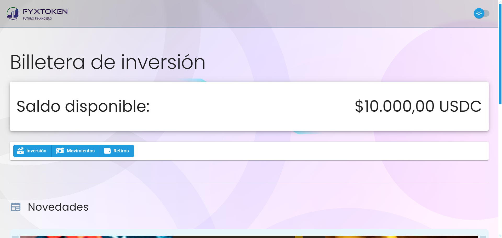
  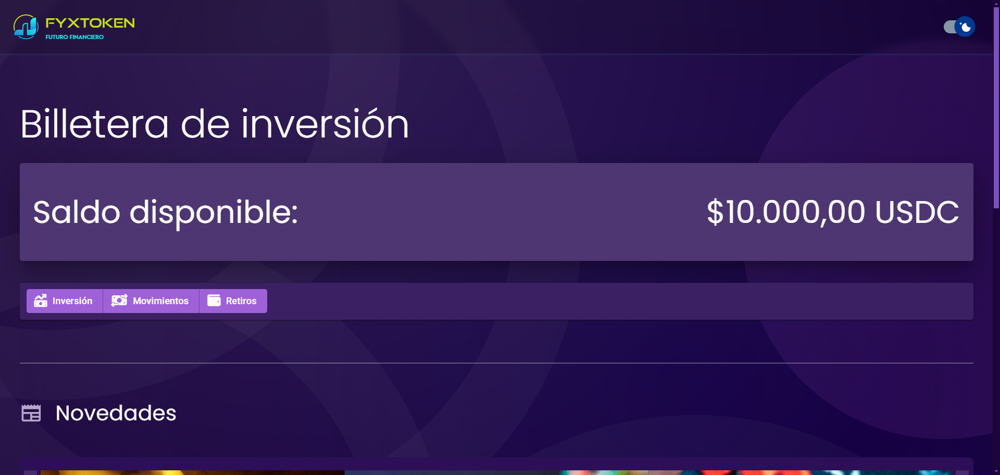
</div>

Centro de control unificado:
- Vista general del portafolio
- Resumen de activos
- Acciones rápidas
- Tema adaptativo

### Inversiones
<div align="center">
  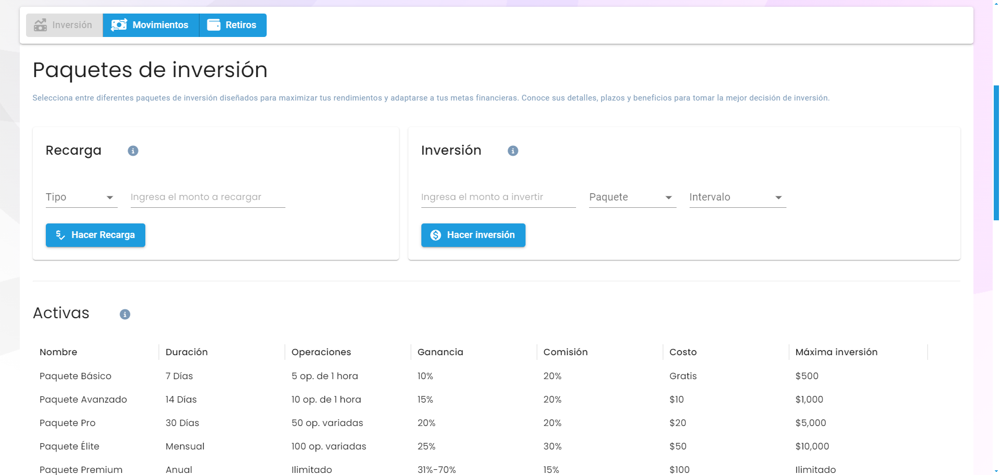
  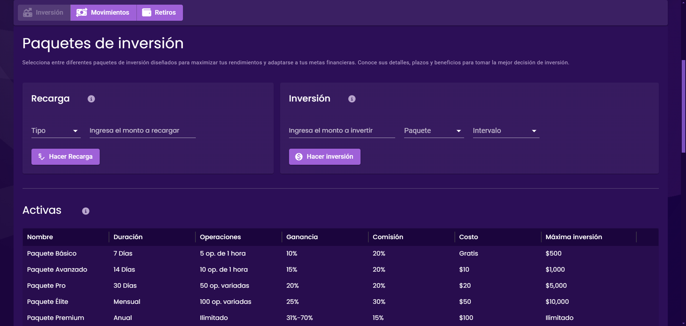
</div>

Panel de inversiones con:
- Visualización de oportunidades
- Estadísticas detalladas
- Gráficos interactivos
- Información en tiempo real

### Movimientos
<div align="center">
  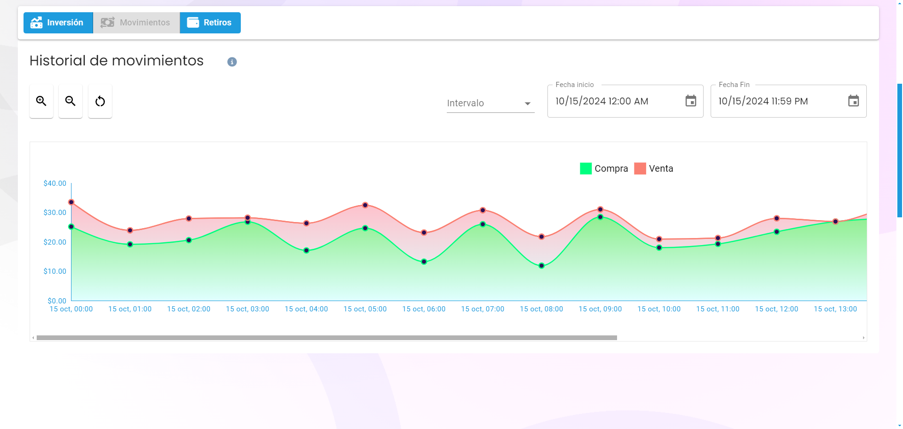
  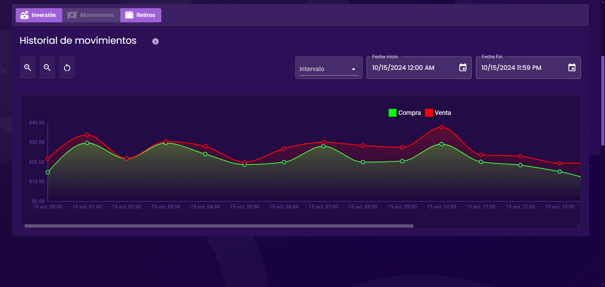
</div>

Seguimiento de transacciones:
- Historial detallado
- Filtros avanzados
- Estado de operaciones
- Exportación de datos

### Retiros
<div align="center">
  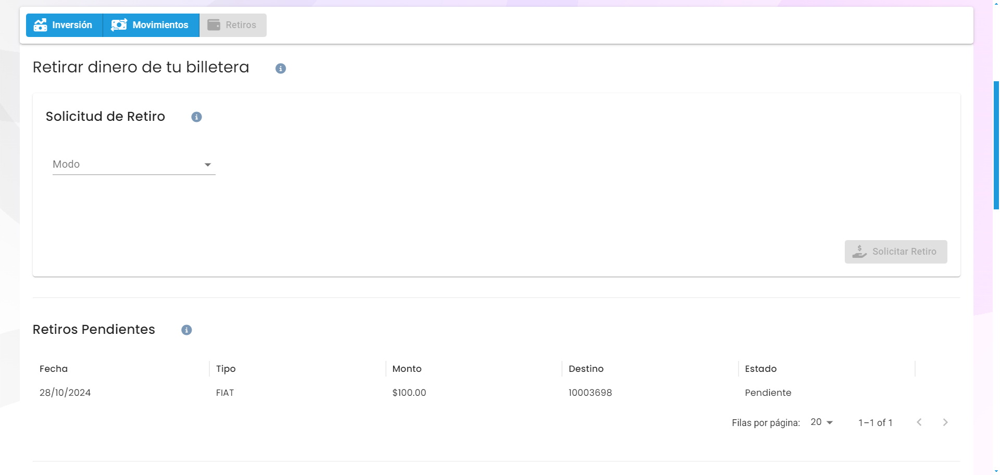
  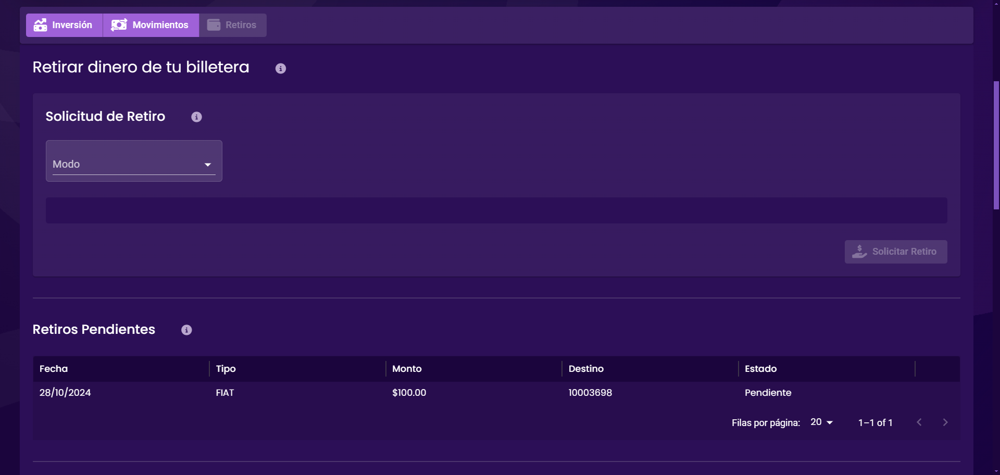
</div>

Gestión de retiros:
- Proceso simplificado
- Múltiples métodos
- Confirmación segura
- Historial de retiros

### Noticias
<div align="center">
  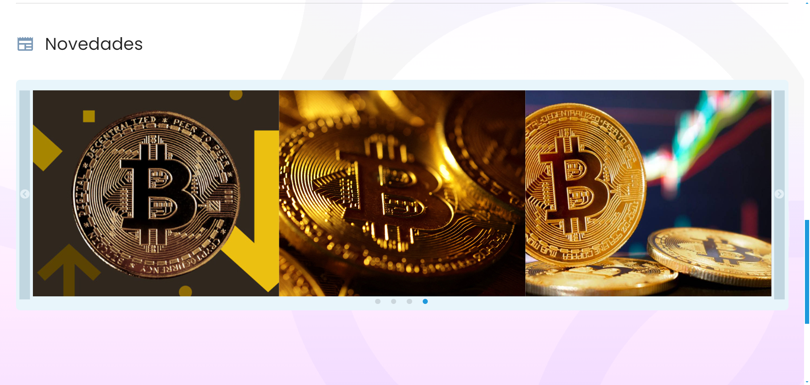
  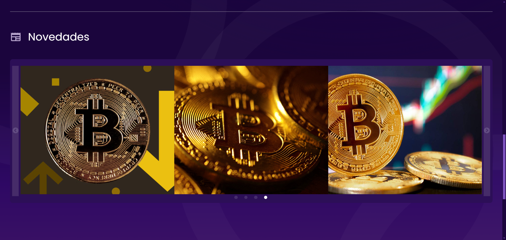
</div>

Centro de información:
- Noticias relevantes
- Actualizaciones del mercado
- Análisis y tendencias
- Filtros por categoría

## 🔧 Desarrollo

### Configuración de Webpack
Utilizamos `react-app-rewired` para personalizar la configuración sin ejectar:
```javascript
// config-overrides.js
module.exports = function override(config, env) {
  // Personalizaciones aquí
  return config;
}
```

### Comandos Útiles
```bash
# Desarrollo
npm start         # Inicia servidor de desarrollo
npm run build    # Construye para producción
```

<br><br>

---
---

<br><br>

## 📄 Licencia

Este es un proyecto propietario. Todos los derechos reservados.

---
<div align="center">
  Desarrollado con ❤️ por el equipo de FyxToken
</div>